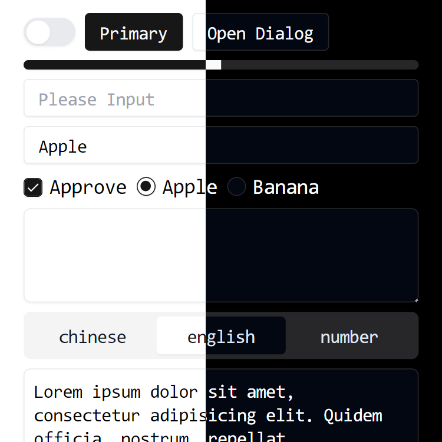

# PXD
Vue component library based on radix-vue and geist design system. Everything is just right.

> [!IMPORTANT]
> The library is still under development and may undergo major changes at any time.



## Install

```bash
pnpm i pxd
```

## Usage

### Styles

### vars.css

```js
import 'pxd/vars.css'
```

### Auto import

```js
// vite.config.js
import { defineConfig } from 'vite'
import VueComponents from 'unplugin-vue-components/vite'
import PxResolver from 'pxd/resolver'

export default defineConfig({
  plugins: [
    VueComponents({
      resolvers: [
        PxResolver({ ...options })
      ]
    })
  ]
})
```

#### Resolver Options
```ts
interface ResolverOptions {
  namespace: string
}
```
You can specify automatically imported component name prefixes by passing in the namespace parameter, such as:
```js
// vite.config.ts
{
  plugins: [
    VueComponents({
      resolvers: [
        resolver({ namespace: 'v' })
      ]
    })
  ]
}
```

```html
<!-- App.vue -->
<template>
  <!-- `px-button` -> `v-button` -->
  <v-button>Button</v-button>
</template>
```

### Global import
We strongly recommend using automatic import because it can significantly reduce the package size.

## Import Directly

```js
import Button from 'pxd/components/button/index.js'

// All components only need to import this style file.
import 'pxd/vars.css'
```

## Acknowledgement
rankings are in no particular order, they are all very important to this project.

- Vite: https://vitejs.dev/
- Iconify: https://iconify.design/
- Geist Design System: https://vercel.com/geist/introduction
